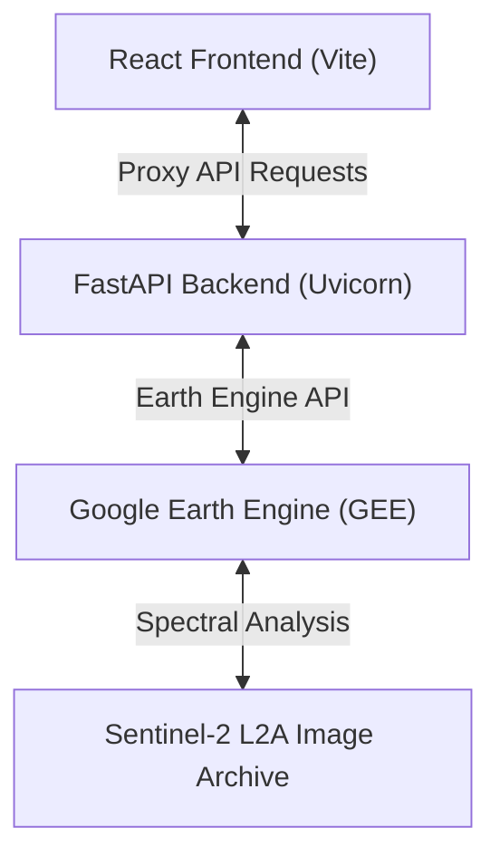
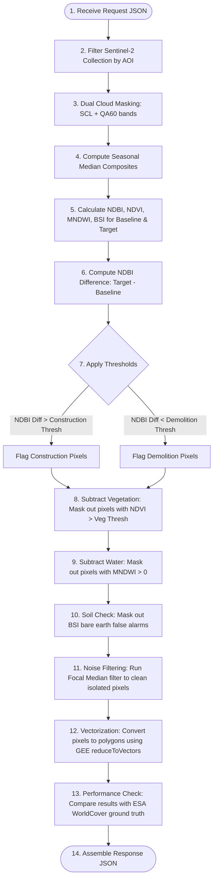

# GeoChronos — Comprehensive Technical Guide & Study Material

Welcome to the **GeoChronos** study guide. This document details the technical inner workings, mathematical formulas, data pipeline, API schemas, and tuning parameters of the GeoChronos Satellite Change Detection Platform.

---

## 1. Architectural Overview

GeoChronos is split into three main components: a React frontend client, a FastAPI Python backend, and the Google Earth Engine (GEE) cloud analysis engine.



### 🛰️ The Data Pipeline Flow
1. The **Frontend** allows the user to sketch an Area of Interest (AOI) and choose temporal windows.
2. The **Backend** receives the geometry and parameters, translates them into GEE operations, and requests seasonal composites.
3. **Google Earth Engine** runs SCL/QA60 cloud masking on the raw Sentinel-2 tiles, builds median composites, calculates indices, runs the ensemble voting classifier, and vectorizes the resulting change pixels.
4. The **Backend** receives the vector results, computes performance metrics, and returns them to the **Frontend** for display on the interactive Leaflet sandbox.

---

## 2. Spectral Indices & Mathematical Foundation

To identify transformations in the land surface, GeoChronos calculates four primary multispectral indices using specific bands of the Sentinel-2 satellite:

| Index Name | Sentinel-2 Bands Used | Mathematical Formula | Purpose in Pipeline |
|------------|----------------------|----------------------|---------------------|
| **NDBI** (Normalized Difference Built-Up Index) | Shortwave Infrared 1 ($B_{11}$), Near-Infrared ($B_8$) | \[\text{NDBI} = \frac{B_{11} - B_8}{B_{11} + B_8}\] | Highlights artificial/man-made concrete surfaces and built-up areas. |
| **NDVI** (Normalized Difference Vegetation Index) | Near-Infrared ($B_8$), Red ($B_4$) | \[\text{NDVI} = \frac{B_8 - B_4}{B_8 + B_4}\] | Identifies healthy green vegetation. Used as a mask to filter out vegetation false positives. |
| **MNDWI** (Modified Normalized Difference Water Index) | Green ($B_3$), Shortwave Infrared 1 ($B_{11}$) | \[\text{MNDWI} = \frac{B_3 - B_{11}}{B_3 + B_{11}}\] | Highlights open water bodies. Used to filter out false changes over water. |
| **BSI** (Bare Soil Index) | Red ($B_4$), Blue ($B_2$), Shortwave Infrared 1 ($B_{11}$), Near-Infrared ($B_8$) | \[\text{BSI} = \frac{(B_{11} + B_4) - (B_8 + B_2)}{(B_{11} + B_4) + (B_8 + B_2)}\] | Detects bare soil. Used to differentiate natural soil from artificial concrete structures. |

---

## 3. Backend Processing Pipeline (`POST /api/analyze`)

The core analytical pipeline is executed inside [backend/main.py](file:///c:/Users/rajku/OneDrive/Desktop/BISAG_LLMarena/backend/main.py) when an analysis is requested:



---

## 4. API Endpoint Schemas (Input & Output Formats)

### 1. `GET /api/health`
Confirms the backend is alive and connected to Google Earth Engine.
* **Request:** None
* **Response (JSON):**
  ```json
  {
    "status": "online",
    "ee_connected": true
  }
  ```

### 2. `POST /api/tiles`
Fetches the XYZ tile layers URLs for the baseline and target years to display on the swipe map.
* **Request (JSON):**
  ```json
  {
    "aoi_geojson": {
      "type": "Polygon",
      "coordinates": [[[72.66, 23.18], [72.68, 23.18], [72.68, 23.20], [72.66, 23.20], [72.66, 23.18]]]
    },
    "start_year": 2021,
    "end_year": 2025
  }
  ```
* **Response (JSON):**
  ```json
  {
    "baseline_url": "https://earthengine.googleapis.com/v1/projects/cdbisag/maps/XYZ-Baseline-Map/tiles/{z}/{x}/{y}",
    "target_url": "https://earthengine.googleapis.com/v1/projects/cdbisag/maps/XYZ-Target-Map/tiles/{z}/{x}/{y}"
  }
  ```

### 3. `POST /api/analyze`
Calculates and vectorizes land changes, running the full ensemble comparison.
* **Request (JSON):**
  ```json
  {
    "aoi_geojson": {
      "type": "Polygon",
      "coordinates": [[[72.66, 23.18], [72.68, 23.18], [72.68, 23.20], [72.66, 23.20], [72.66, 23.18]]]
    },
    "start_year": 2021,
    "end_year": 2025,
    "construction_thresh": 0.03,
    "demolition_thresh": -0.04,
    "min_patch_pixels": 2,
    "ndvi_veg_thresh": 0.4,
    "ensemble_votes": 1
  }
  ```
* **Response (JSON):**
  ```json
  {
    "metrics": {
      "accuracy": 89.2,
      "precision": 81.5,
      "recall": 78.3,
      "f1": 79.9,
      "total_area_ha": 352.4,
      "construction_area_ha": 12.8,
      "demolition_area_ha": 3.4,
      "wrong_area_ha": 1.2,
      "tp": 12800,
      "tn": 325400,
      "fp": 2900,
      "fn": 3500
    },
    "detected_geojson": {
      "type": "FeatureCollection",
      "features": [
        {
          "type": "Feature",
          "properties": { "change_type": "construction", "area_sqm": 450.0 },
          "geometry": { "type": "Polygon", "coordinates": [...] }
        },
        {
          "type": "Feature",
          "properties": { "change_type": "demolition", "area_sqm": 250.0 },
          "geometry": { "type": "Polygon", "coordinates": [...] }
        }
      ]
    },
    "raster_download_url": "https://earthengine.googleapis.com/v1/projects/cdbisag/downloads/Change-Map-Tiff-Url",
    "baseline_tile_url": "https://earthengine.googleapis.com/v1/projects/cdbisag/maps/XYZ-Baseline-Map/tiles/{z}/{x}/{y}",
    "target_tile_url": "https://earthengine.googleapis.com/v1/projects/cdbisag/maps/XYZ-Target-Map/tiles/{z}/{x}/{y}",
    "n_construction": 14,
    "n_demolition": 5
  }
  ```

---

## 5. Sensitivity Parameters & Tuning Guide

| Parameter Label | Variable Name | Default Value | Range | Function & Tuning Impact |
|-----------------|---------------|---------------|-------|--------------------------|
| **Baseline Year** | `start_year` | `2021` | `2015` to `Current - 1` | The reference starting year for the comparison. |
| **Target Year** | `end_year` | `2025` | `2016` to `Current` | The ending year. Must be greater than the baseline year. |
| **Construction Threshold** | `construction_thresh` | `0.03` | `0.01` to `0.20` | Minimum increase in NDBI required to flag construction. **Lowering** this makes the algorithm more sensitive (detects smaller concrete additions but increases false alarms). |
| **Demolition Threshold** | `demolition_thresh` | `-0.04` | `-0.20` to `-0.01` | Minimum drop in NDBI to flag demolition. **Raising** this toward 0 makes it detect smaller structure removals. |
| **Min Patch Size (px)** | `min_patch_pixels` | `2` | `1` to `10` | The minimum number of connected change pixels (1 pixel $\approx 100\text{ m}^2$). Filters out "salt-and-pepper" noise. Keep at `1-3` for small areas, and raise to `4-8` for large regional studies to show only cohesive build sites. |
| **Vegetation Mask NDVI** | `ndvi_veg_thresh` | `0.40` | `0.20` to `0.60` | Pixels greener than this are masked out from construction detections. Prevents seasonal plant growth and crop cycles from being flagged as construction. |
| **Ensemble Votes (of 4)** | `ensemble_votes` | `1` | `1` to `4` | Number of individual index change maps (NDBI, NDVI, BSI, MNDWI) that must agree to confirm a change. Keep at `1` for small boundaries, and raise to `2` or `3` to filter false positives on complex terrain. |

---

## 6. Confusion Matrix & Metrics Calculations

The performance evaluation metrics shown in Step 4 are computed dynamically inside GEE using standard remote sensing classification formulas:

* **True Positives (TP):** Pixels correctly identified as changed.
* **True Negatives (TN):** Pixels correctly identified as unchanged.
* **False Positives (FP) / False Alarms:** Pixels flagged as changed that are actually unchanged.
* **False Negatives (FN) / Misses:** Pixels that changed but were missed by the algorithm.

### 📐 Performance Equations
$$\text{Accuracy} = \frac{\text{TP} + \text{TN}}{\text{TP} + \text{TN} + \text{FP} + \text{FN}} \times 100\%$$

$$\text{Precision} = \frac{\text{TP}}{\text{TP} + \text{FP}} \times 100\%$$

$$\text{Recall} = \frac{\text{TP}}{\text{TP} + \text{FN}} \times 100\%$$

$$\text{F1-Score} = 2 \times \frac{\text{Precision} \times \text{Recall}}{\text{Precision} + \text{Recall}} \times 100\%$$
